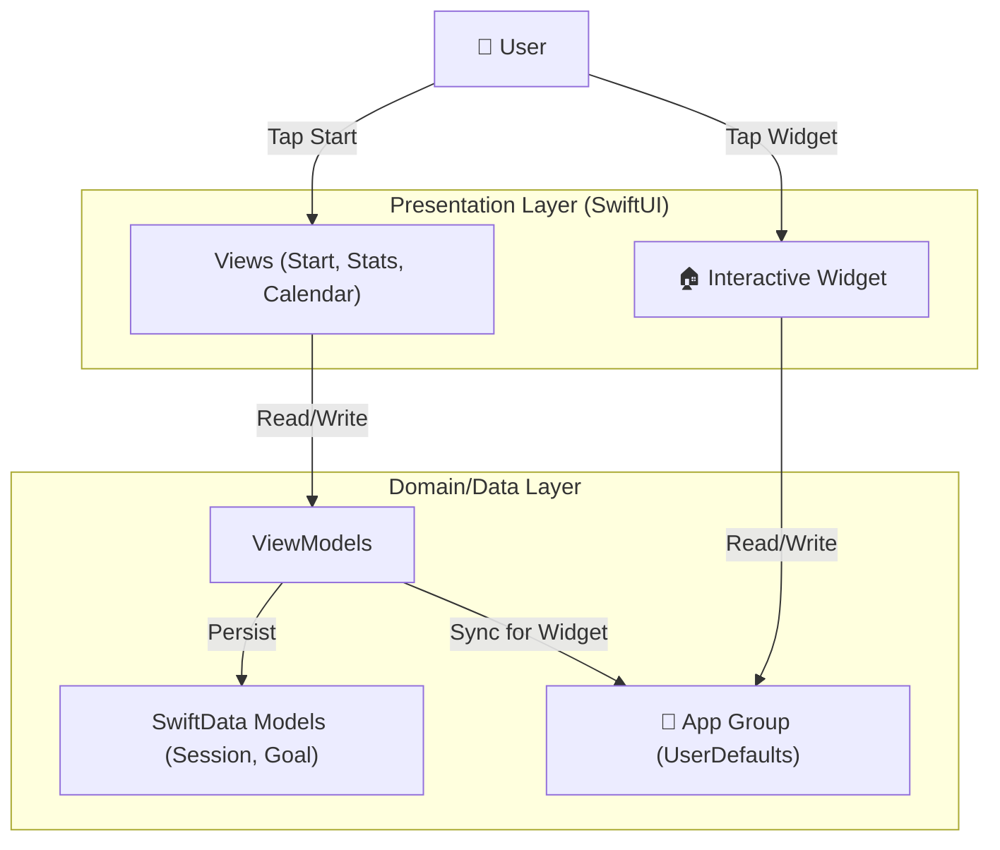

# StudyReel - Focus & Record 📹

  <b>「学習の瞬間を記録し、モチベーションを可視化する」</b> 
  Interactive Study Timer App with Native iOS 17+ Widgets

---

## 📖 概要 (Overview)

**StudyReel** は、単なる学習タイマーではありません。「学習した証（あかし）」を残すことで継続的なモチベーションを生み出す、ネイティブiOSアプリケーションです。

学習時間を記録するだけでなく、**SwfitData** による堅牢なデータ管理、**統計グラフ** による成長の可視化、そして **iOS 17 Interactive Widgets** による「ホーム画面から0秒で開始できる」スムーズな体験を提供します。

## ✨ 主な機能 (Key Features)

### 1. ⏱️ Focus Timer & Recorder
* **概要:** シンプルで集中を妨げないタイマー。
* **特徴:** カメラプレビュー機能を統合しており、自分の勉強風景をタイムラプスのように記録する準備も整っています（将来機能）。

### 2. 📊 Visual Stats & Calendar
* **概要:** 「どれだけ頑張ったか」を一目で確認できる分析機能。
* **技術:** `SwiftCharts` を活用した美しいトレンドグラフと、ヒートマップ形式のカレンダー表示で、日々の積み重ねを可視化します。

### 3. 🏷️ Smart Tagging & Goals
* **概要:** 科目やプロジェクトごとの細やかな管理。
* **機能:** タグによる学習内容の分類機能と、日次/週次の目標設定機能（Goal Setting）により、計画的な学習をサポートします。

### 4. 📱 Interactive Pomodoro Widget (New!)
* **概要:** iOS 17+ の最新機能を活用したホーム画面ウィジェット。
* **技術:** `WidgetKit` + `AppIntent`。アプリを開くことなく、ホーム画面上のボタンをタップするだけで25分ポモドーロタイマーを開始/停止できます。

---

## 🛠 技術スタック (Tech Stack)

最新のAppleプラットフォーム技術を積極的に採用しています。

| Category | Technology | Usage |
| :--- | :--- | :--- |
| **Language** | **Swift 5.9+** | iOS Native Development |
| **UI Framework** | **SwiftUI** | Declarative User Interface |
| **Database** | **SwiftData** | Modern Persistence Framework (iOS 17+) |
| **Widget** | **WidgetKit** | Interactive Widgets (App Intents) |
| **Charts** | **Swift Charts** | Native Data Visualization |
| **Concurrency** | **Swift Concurrency** | async/await |
| **Architecture** | **MVVM** | Clean Architecture pattern |

---

## 🏗️ アーキテクチャ (Architecture)

---

## 🚀 セットアップ (Getting Started)

### Prerequisites
*   Xcode 15.0+
*   iOS 17.0+ (Target Deployment: 18.5)

### Build
1.  Open `StudyTimerAndVideo.xcodeproj` in Xcode.
2.  Select your Development Team in `Signing & Capabilities`.
3.  Ensure App Groups (`group.com.ni.StudyTimerAndVideo`) are configured for both targets.
4.  Run (`Cmd + R`).

---

## 👨‍💻 開発者 (Developer)
**Enludus**

Focus: Native iOS & Flutter Development
Contact: <https://enludus.vercel.app>

 
    © 2025 StudyReel Project. All rights reserved. 

