# StudyReel - Focus & Record 📹

  <b>"Record the moment of learning, visualize motivation."</b> 
  Interactive Study Timer App with Native iOS 17+ Widgets

---

[🇯🇵 Japanese (日本語)](README.ja.md)

## 📖 Overview

**StudyReel** is not just a study timer. It is a native iOS application that generates continuous motivation by leaving "Proof of Learning".

It provides not only recording of study time but also robust data management with **SwiftData**, visualization of growth with **Statistical Graphs**, and a smooth experience of "Starting from the Home Screen in 0 seconds" with **iOS 17 Interactive Widgets**.

## ✨ Key Features

### 1. ⏱️ Focus Timer & Recorder
*   **Overview:** A simple timer that does not disturb concentration.
*   **Feature:** Integrated camera preview function allows you to record your study scene like a time-lapse.
*   **Update:** Implemented **"No Recording Mode"** and **"Disable Auto-Lock (during study)"** based on user feedback to minimize stress during study.

### 2. 📊 Visual Stats & Calendar
*   **Overview:** Analytics feature to check "how hard you worked" at a glance.
*   **Technology:** Visualizes daily accumulation with beautiful trend graphs using `SwiftCharts` and heatmap-style calendar display.

### 3. 🏷️ Smart Tagging & Goals
*   **Overview:** Detailed management by subject or project.
*   **Feature:** Supports planned learning with content classification by tags and daily/weekly goal setting functions.

### 4. 📱 Interactive Pomodoro Widget (New!)
*   **Overview:** Home screen widget utilizing the latest features of iOS 17+.
*   **Technology:** `WidgetKit` + `AppIntent`. Start/Stop a 25-minute Pomodoro timer just by tapping a button on the home screen without opening the app.

---

## 🛠 Tech Stack

Actively adopting the latest Apple platform technologies.

| Category | Technology | Usage |
| :--- | :--- | :--- |
| **Language** | **Swift 5.9+** | iOS Native Development |
| **UI Framework** | **SwiftUI** | Declarative User Interface |
| **Database** | **SwiftData** | Modern Persistence Framework (iOS 17+) |
| **Widget** | **WidgetKit** | Interactive Widgets (App Intents) |
| **Charts** | **Swift Charts** | Native Data Visualization |
| **Concurrency** | **Swift Concurrency** | async/await |
| **Architecture** | **MVVM** | Clean Architecture pattern |

---

## 🏗️ Architecture

```mermaid
graph TD
    User["📱 User"]
    
    subgraph "Presentation Layer (SwiftUI)"
        Views["Views (Start, Stats, Calendar)"]
        Widget["🏠 Interactive Widget"]
    end
    
    subgraph "Domain/Data Layer"
        VM["ViewModels"]
        Model["SwiftData Models (Session, Goal)"]
        Shared["📂 App Group (UserDefaults)"]
    end

    %% Flows
    User -->|Tap Start| Views
    User -->|Tap Widget| Widget
    
    Views -->|Read/Write| VM
    Widget -->|Read/Write| Shared
    
    VM -->|Persist| Model
    VM -->|Sync for Widget| Shared
```

---

## 🚀 Getting Started

### Prerequisites
*   Xcode 15.0+
*   iOS 17.0+ (Target Deployment: 18.5)

### Build
1.  Open `StudyTimerAndVideo.xcodeproj` in Xcode.
2.  Select your Development Team in `Signing & Capabilities`.
3.  Ensure App Groups (`group.com.ni.StudyTimerAndVideo`) are configured for both targets.
4.  Run (`Cmd + R`).

---

## 👨‍💻 Developer
**Enludus**

Focus: Native iOS & Flutter Development
Contact: https://enludus.vercel.app

 
    © 2025 StudyReel Project. All rights reserved. 

